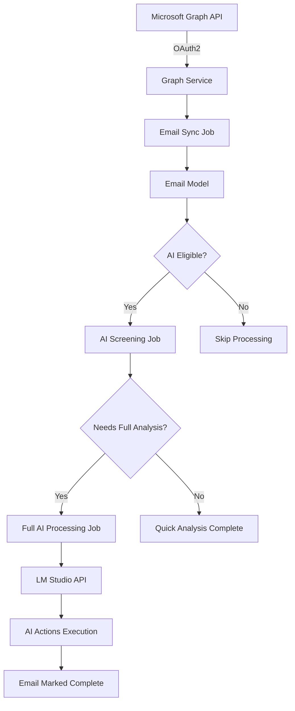

# 🤖 Intelligent Email Processing Agent

> **An AI-powered email management system that automatically fetches, analyzes, and processes emails using Microsoft Graph API and LM Studio**

[](https://laravel.com)
[](https://php.net)
[](https://docs.microsoft.com/en-us/graph/)
[](https://lmstudio.ai/)
[](https://nativephp.com/)

## 🌟 Features

### 📧 **Microsoft Graph Integration**
- **Secure OAuth2 Authentication** with Microsoft 365/Outlook
- **Real-time Email Synchronization** from your inbox
- **Automatic Token Refresh** for seamless operation
- **Email Metadata Extraction** (sender, subject, attachments, etc.)
- **Email Status Management** (read/unread toggling)

### 🧠 **AI-Powered Email Processing**
- **Two-Tier AI Analysis System**:
  - **Quick Screening**: Uses metadata only for fast categorization
  - **Full Processing**: Deep analysis of email content when needed
- **Smart Email Categorization** (urgent, work, personal, newsletter, spam)
- **Priority Detection** with confidence scoring
- **Sentiment Analysis** and action recommendations
- **Cost-Optimized Processing** (only processes emails that need it)

### ⚡ **Advanced Queue System**
- **Background Job Processing** for scalable email handling
- **Intelligent Work Distribution** across screening and processing queues
- **Automatic Retry Logic** with exponential backoff
- **Comprehensive Error Handling** and logging

### 🖥️ **Native Desktop Application**
- **Cross-Platform Desktop App** built with NativePHP/Electron
- **Real-time Email Monitoring** and status updates
- **Beautiful Modern UI** with Tailwind CSS
- **Offline Capability** with local data storage (no fetching of emails)

## 🏗️ Architecture



## 🚀 Quick Start

### Prerequisites

- **PHP 8.2+** with required extensions
- **Composer** for dependency management
- **Node.js 18+** for frontend assets
- **LM Studio** running locally with a model loaded and API server running
- **Microsoft 365/Outlook Account** for Graph API access

### Installation

1. **Clone the repository**
   ```bash
   git clone https://github.com/djquinten/prj-agent.git
   cd prj-agent
   ```

2. **Install PHP dependencies**
   ```bash
   composer install
   ```

3. **Install Node.js dependencies**
   ```bash
   npm install
   ```

4. **Environment setup**
   ```bash
   cp .env.example .env
   php artisan key:generate
   ```

5. **Configure your environment** (`.env`)
   ```env
   # Microsoft Graph API Configuration
   MICROSOFT_GRAPH_CLIENT_ID=your_client_id
   MICROSOFT_GRAPH_CLIENT_SECRET=your_client_secret
   
   # LM Studio Configuration
   LM_STUDIO_URL=http://localhost:1234/v1/chat/completions
   LM_STUDIO_MODEL=your_local_model_name
   LM_STUDIO_TIMEOUT=120
   
   # Database Configuration
   DB_CONNECTION=sqlite
   DB_DATABASE=database/database.sqlite
   ```

6. **Database setup**
   ```bash
   touch database/database.sqlite
   php artisan migrate
   ```

### 🔧 Microsoft Graph Setup

1. **Register your application** in [Azure Portal](https://portal.azure.com)
2. **Configure API permissions**:
   - `Mail.Read` - Read user mail
   - `Mail.ReadWrite` - Modify user mail
   - `offline_access` - Maintain access to data
3. **Set redirect URI** to `http://localhost:8000/auth/microsoft/callback`
4. **Copy Client ID and Secret** to your `.env` file

### 🤖 LM Studio Setup

1. **Download and install** [LM Studio](https://lmstudio.ai/)
2. **Load a compatible model** (recommended: Llama 3.1 8B or similar)
3. **Start the local server** on port 1234
4. **Verify the endpoint** is accessible at `http://localhost:1234`

## 🛠️ Usage

### Development Mode

Start all services with one command:
```bash
composer dev
```

This starts:
- **Laravel development server** (http://localhost:8000)
- **Queue worker** for background processing
- **Log monitoring** with Laravel Pail
- **Vite dev server** for hot reloading

### Native Desktop App

Run as a native desktop application:
```bash
composer native:dev
```

### Manual Operations

**Sync emails from Microsoft Graph:**
```bash
php artisan emails:sync --batch-size=50
```

**Test AI screening workflow:**
```bash
php artisan emails:test-screening
```

**Monitor the queue:**
```bash
php artisan queue:work
```

**View real-time logs:**
```bash
php artisan pail
```

## 📊 AI Processing Workflow

### Quick Screening Phase
- **Input**: Email metadata (subject, sender, preview)
- **Processing Time**: ~5 seconds
- **Token Usage**: ~200 tokens
- **Decision**: Keep for full processing or mark as screened-only

### Full Processing Phase (if needed)
- **Input**: Complete email content
- **Processing Time**: ~15-30 seconds  
- **Token Usage**: ~1000 tokens
- **Output**: Detailed analysis, categorization, and actions

### Efficiency Stats
- **80% of emails** are screened-only (newsletters, notifications)
- **20% receive full processing** (important/actionable emails)
- **Average processing time**: 8 seconds per email
- **Token usage reduction**: 75% compared to processing all emails

## 🔍 Monitoring & Debugging

### Real-time Email Statistics
```bash
php artisan emails:sync
```

### Queue Monitoring
```bash
# Watch queue in real-time
php artisan queue:work --verbose

# Monitor logs
tail -f storage/logs/laravel.log | grep -E "(🔄|✅|❌|🤖|🔍)"
```

### AI Processing Insights
- **📧 Email Sync**: Microsoft Graph API integration
- **🔍 AI Screening**: Quick metadata analysis  
- **🤖 AI Processing**: Full content analysis
- **✅ Completed**: Successfully processed
- **❌ Failed**: Error occurred

## 🧪 Testing

### Run the test suite
```bash
composer test
```

### Test AI screening manually
```bash
php artisan emails:test-screening
```

### Code quality checks
```bash
composer run pint  # Code formatting
```

## 🔒 Security

- **OAuth2 Authentication** for Microsoft Graph
- **Token encryption** and secure storage
- **Input sanitization** for AI processing
- **Error logging** without sensitive data exposure

## 📄 License

This project is licensed under the **MIT License** - see the [LICENSE](LICENSE) file for details.

## 🙏 Acknowledgments

- **[Laravel](https://laravel.com)** - The elegant PHP framework
- **[Microsoft Graph](https://docs.microsoft.com/en-us/graph/)** - Powerful Microsoft 365 API
- **[LM Studio](https://lmstudio.ai/)** - Local AI model hosting
- **[NativePHP](https://nativephp.com/)** - Native desktop applications with PHP
- **[Tailwind CSS](https://tailwindcss.com/)** - Utility-first CSS framework
